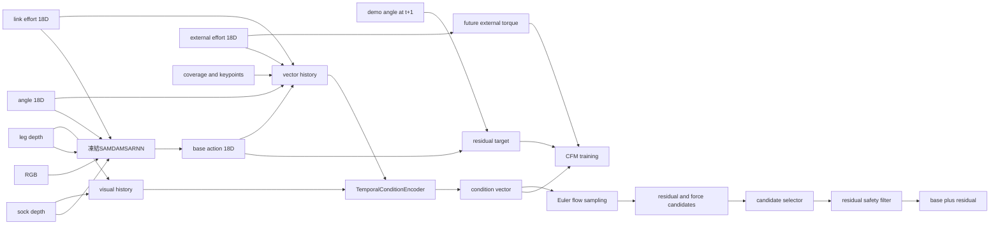
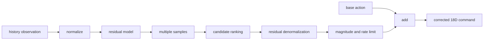

# 残差フローモデル構成とデータフロー

## 1. 文書の対象

本書は、`dress_regrasping/residual_flow/` に追加した以下の処理を説明する。

- ShareSetデータの監査と厳格な読み込み
- 凍結したSAMDAMSARNNからのベース行動出力
- デモ行動とベース行動の差による疑似残差教師の生成
- 決定論的残差モデル
- Residual Action-Chunk Conditional Flow Matching（Action CFM）
- 残差行動と将来外力を同時生成するForce-aware CFM
- 複数候補の選択、残差制限、外力異常検知

ShareSetは読み取り専用とし、既存のSAMDAMSARNN、データ、オンライン制御コードは変更しない。

## 2. 現在の実装範囲

### 実装済み

| 機能 | 実装 |
|---|---|
| データ契約 | `contracts.py` |
| データ監査 | `audit.py`, `data.py` |
| ベース行動の書き出し | `base_predictions.py` |
| 残差ウィンドウ生成 | `data.py` |
| trainデータだけを使う正規化 | `normalization.py` |
| 決定論的残差モデル | `models.py::DeterministicResidualPolicy` |
| Action CFM | `models.py::ConditionalFlowPolicy` |
| Force-aware CFM | `models.py::ForceAwareConditionalFlowPolicy` |
| CFM損失・Eulerサンプリング | `training.py` |
| 3モデルの比較学習 | `run_comparison.py` |
| オフライン評価 | `evaluation.py` |
| 候補選択・安全制限 | `safety.py` |
| ベース行動への残差適用 | `runtime.py` |
| 正常外力からの逸脱検知 | `validate_anomaly.py` |

### 現在未実行・未接続

- 実機ROSトピックへの接続
- 手先SE(3)残差と逆運動学
- coverage進捗予測ヘッド
- デモ支持範囲を学習する密度モデル
- 引っ掛かり、滑りを区別する教師あり分類
- 実機での接触力低減効果の検証

現在のモデルが出力する行動は、既存制御へ直接加算できる**18次元関節位置残差**である。手先位置・姿勢残差ではない。

## 3. ShareSet側のデータ

1エピソードについて、以下を使用する。

| 入力 | 形状 | 意味 |
|---|---:|---|
| `camera_right` | `(T,3,H,W)` | 右カメラRGB。ベースモデル用 |
| `depth_mask/sock_depth` | `(T,1,H,W)` | 靴下領域の深度 |
| `depth_mask/leg_depth` | `(T,1,H,W)` | 足領域の深度 |
| `angle.csv` | `(T,18)` | 両腕、両グリッパーの位置 |
| `torque.csv` | `(T,18)` | `link_effort`。ベースモデル用 |
| `external_torque.csv` | `(T,18)` | `external_effort`。残差モデルの触覚代理 |
| `features/` | `(T,*)` | coverage、開口部、踵、つま先等 |

18次元の行動順序は次の通りである。

```text
left_arm joint_1 ... joint_7,
left_gripper finger_joint, mimic_joint,
right_arm joint_1 ... joint_7,
right_gripper finger_joint, mimic_joint
```

腕はrad、グリッパーはmであり、同じベクトル内で単位が異なる。

### 3.1 `torque`と`external_torque`の役割

両者を混同しない。

- `torque.csv`
  - ROSの`link_effort`
  - 既存SAMDAMSARNNの36次元入力の後半
  - 関節の駆動・重力・慣性等を含み得る
- `external_torque.csv`
  - ROSの`external_effort`
  - 新規残差モデルの力覚代理
  - そのまま手先6軸レンチを意味するわけではない

手先力へ変換する場合は、関節角、ロボットモデル、ヤコビアン、外力推定条件が別途必要になる。現在の実装では18次元`external_torque`を直接入力する。

## 4. データ監査

`audit.py`は`dataset_sock.yaml`に記載された半開区間`[start,end)`について、次を検査する。

1. `angle.csv`、`torque.csv`、`external_torque.csv`が存在する
2. 各CSVが18列である
3. 行数が`end`まで存在する
4. RGB、mask、depth maskのフレーム数
5. `features/`に必要なnpyが存在する
6. `touch.csv`の有無

監査結果は`artifacts/data_audit.json`に保存する。欠損値を別の値で埋めて学習を続行せず、入力契約違反として停止する。

現時点の監査では、11エピソードすべてで以下が不足している。

- `depth_mask/leg_depth`
- `features/coverage.npy`
- `features/opening_norm.npy`
- `features/heel_norm.npy`
- `features/toe_norm.npy`
- `features/foot_length.npy`
- `features/features_ok.npy`

したがって、実データによる残差学習はこれらの再生成後に実行する。

## 5. 全体データフロー



## 6. ベース行動と疑似残差教師

### 6.1 ベース行動

`base_predictions.py`は、凍結したSAMDAMSARNNに各時刻の観測をteacher forcingで入力する。

```text
o_t = {
  RGB_t,
  sock_depth_t,
  leg_depth_t,
  angle_t,
  link_torque_t
}

a_base_t = SAMDAMSARNN(o_t, recurrent_state_t)
```

SAMDAMSARNNは36次元を出力するが、残差教師に使用するのは先頭18次元の次時刻関節位置予測である。後半18次元の予測トルクは制御指令には使用しない。

### 6.2 teacher forcingを使う理由

残差教師生成時は、前時刻のモデル出力を次の入力へ戻さず、記録された実観測を各時刻へ入力する。ただし、SAMDAMSARNNの再帰状態は時系列に沿って保持する。

これにより、残差は主に「記録された状態におけるベースポリシーの1ステップ予測誤差」を表す。閉ループで蓄積した誤差からの復帰行動を表すものではない。

### 6.3 疑似残差

現在の18次元関節空間では、残差教師を次で定義する。

```math
r_t = a^{demo}_{t+1} - a^{base}_t
```

長さ`H`のaction chunkは次の通りである。

```math
R_t =
\left[
r_t,\,
r_{t+1},\,
\ldots,\,
r_{t+H-1}
\right]
\in \mathbb{R}^{H \times 18}
```

ベースモデルを同一エピソードで学習・評価すると、記憶によって残差が不自然に小さくなる可能性がある。そのため`base_predictions.py`は、各エピソードを除外して学習したチェックポイントの対応表を受け取るcross-fitting構成をサポートする。

## 7. 学習サンプル

`ResidualWindowDataset`が返す1サンプルは以下である。

| キー | 形状 |
|---|---:|
| `visual` | `(L,2,H_img,W_img)` |
| `angles` | `(L,18)` |
| `link_torque` | `(L,18)` |
| `external_torque` | `(L,18)` |
| `features` | `(L,F)` |
| `base_action` | `(L,18)` |
| `residual_chunk` | `(H,18)` |
| `future_external_torque` | `(H,18)` |
| `valid` | scalar bool |

ここで、

- `L`: 観測履歴長。既定値10ステップ
- `H`: 予測チャンク長。既定値4ステップ
- 制御周期: 5 Hzを想定

したがって既定値では、過去約2秒を条件として将来約0.8秒を生成する。オンラインではチャンク全体を一度に実行せず、先頭1ステップだけを実行して次周期に再生成する。

## 8. 正規化

`ResidualNormalizer`はtrainエピソードのみから、チャンネル単位の平均と標準偏差を求める。

```math
\hat{x}_i = \frac{x_i-\mu_i}{\max(\sigma_i,\epsilon)}
```

以下は別々に正規化する。

- 関節角
- link torque
- external torque
- 視覚由来特徴量
- ベース行動
- 残差行動

特に、残差行動と将来外力を別スケールで正規化してから結合する。これを行わない場合、値の分散が大きい外力チャンネルがCFM損失を支配する可能性がある。

深度画像は`[0,255]`から`[0,1]`へ変換する。

## 9. 共通Condition Encoder

3つの比較モデルは、同じ`TemporalConditionEncoder`を使う。

### 9.1 視覚エンコーダ

各時刻の2チャンネル深度画像を小型CNNへ入力する。

```text
input: (B,L,2,H,W)
reshape: (B*L,2,H,W)
Conv2d 2 -> 8, kernel 5, stride 2
SiLU
Conv2d 8 -> 16, kernel 3, stride 2
SiLU
Conv2d 16 -> 24, kernel 3, stride 2
SiLU
AdaptiveAvgPool2d(1,1)
Linear 24 -> visual_dim
LayerNorm
output: (B,L,visual_dim)
```

入力2チャンネルは`sock_depth`と`leg_depth`である。

### 9.2 ベクトル特徴

各時刻で次を連結する。

```text
visual feature
angle 18D
link torque 18D
external torque 18D
base action 18D
coverage/keypoint features FD
```

連結後、Linear、SiLU、LayerNormを適用し、GRUへ入力する。

```text
GRU input : (B,L,frame_dim)
GRU hidden: (B,condition_dim)
```

GRUの最終隠れ状態を、決定論的モデルとフロー速度場の条件`c`として使用する。

### 9.3 現在の実装とForceFlow論文との差

現在の実装は小規模データ向けの共通GRUエンコーダであり、論文ForceFlowの完全な再現ではない。

- 現在: 視覚と力を時刻ごとに連結しGRUで統合
- 未実装: 力履歴をFiLM/AdaLNでフローブロックごとに注入
- 未実装: cross-attentionによる視覚トークン条件付け
- 未実装: DiTバックボーン

少数の実データで大規模DiTが過学習することを避けるため、現段階では小型MLP速度場を採用している。

## 10. 比較モデル

### 10.1 Zero Residual

```math
r_t = 0
```

既存ベースポリシーを変更しない比較対象である。

### 10.2 Deterministic Residual Policy

条件ベクトルから、1つの残差チャンクを直接回帰する。

```text
condition_dim
 -> Linear
 -> SiLU
 -> Linear
 -> H * 18
 -> reshape (H,18)
```

損失は有効サンプルに対する平均二乗誤差である。

```math
\mathcal{L}_{det}
=
\frac{1}{N}
\sum_n
\left\|
\hat{R}_n-R_n
\right\|_2^2
```

このモデルは複数の有効な補正を表現せず、条件ごとに1つの平均的な補正を出力する。

## 11. Conditional Flow Matching

### 11.1 目的

決定論的回帰では、同じような観測に対して複数の有効な補正が存在すると、それらを平均した行動を出す可能性がある。

Conditional Flow Matchingでは、単純な事前分布から残差行動分布へ移す連続な速度場を学習する。

```math
\epsilon \sim \mathcal{N}(0,I)
```

```math
\frac{d x_\tau}{d\tau}
=
v_\theta(x_\tau,\tau,c)
```

- `x`: 生成中のaction chunk
- `τ`: flow time。実時間やロボット時刻ではない
- `c`: 視覚、力履歴、状態、ベース行動から得た条件
- `vθ`: 学習する条件付き速度場

### 11.2 データ形状

Action CFMでは、生成対象を次とする。

```math
x \in \mathbb{R}^{H \times 18}
```

実装では一度`H*18`へ平坦化し、MLP速度場へ入力した後、`(H,18)`へ戻す。

### 11.3 確率経路

現在の実装は、ガウスノイズとデータの間の直線経路を使う。

```math
x_\tau
=
(1-\tau)\epsilon+\tau x_1
```

- `τ=0`: ガウスノイズ`ε`
- `τ=1`: 教師データ`x1`

この経路の目標速度は一定である。

```math
u_\tau
=
\frac{d x_\tau}{d\tau}
=
x_1-\epsilon
```

### 11.4 速度場

`ConditionalVelocityNetwork`は次を連結してMLPへ入力する。

```text
flattened flow state x_tau
flow time tau
condition vector c
```

構成は次の通りである。

```text
Linear(sample_dim + condition_dim + 1 -> hidden_dim)
SiLU
Linear(hidden_dim -> hidden_dim)
SiLU
Linear(hidden_dim -> sample_dim)
```

Action CFMの場合、

```text
sample_dim = H * 18
```

Force-aware CFMの場合、

```text
sample_dim = H * (18 + 18)
```

となる。

### 11.5 CFM損失

各ミニバッチで以下を行う。

1. 教師`x1`を取得する
2. 同じ形状のガウスノイズ`ε`を生成する
3. `τ ~ Uniform(0,1)`を生成する
4. `xτ=(1-τ)ε+τx1`を作る
5. 目標速度`x1-ε`を計算する
6. 速度場のMSEを最小化する

```math
\mathcal{L}_{CFM}
=
\mathbb{E}_{x_1,\epsilon,\tau}
\left[
\left\|
v_\theta(x_\tau,\tau,c)
-
(x_1-\epsilon)
\right\|_2^2
\right]
```

`features_ok=False`のウィンドウは損失集計から除外する。

### 11.6 推論

推論時は教師データを使わず、ガウスノイズから開始する。

```math
x_0 \sim \mathcal{N}(0,I)
```

現在は固定ステップの陽的Euler法でODEを積分する。

```math
x_{\tau+\Delta\tau}
=
x_\tau
+
\Delta\tau\,
v_\theta(x_\tau,\tau,c)
```

```math
\Delta\tau = \frac{1}{K}
```

`K`はODE評価回数であり、既定値は8または16である。`τ=0`から`τ=1`まで積分した結果を生成サンプルとする。

同じ条件`c`でも初期ノイズを変えることで、複数の残差候補を生成できる。

### 11.7 Action CFMが表現できる「複数行動」

フローモデルに複数候補を出す能力があっても、データに複数の補正様式が含まれていなければ有効な多峰性は学習されない。

現在のデータでは、同一または近い状態から異なる補正を行った反復試行が少ない。そのため候補間の差が、

- 本当に異なる有効補正
- センサノイズ
- エピソード差
- 学習不足によるばらつき

のどれであるかを、候補分散だけから判断してはいけない。

## 12. Force-aware Conditional Flow Matching

### 12.1 生成対象

Force-aware CFMでは、残差行動と将来外力をチャンネル方向へ連結する。

```math
y_t
=
\left[
R_t,\,
F_{t+1:t+H}
\right]
\in
\mathbb{R}^{H \times 36}
```

ここで、

```math
R_t \in \mathbb{R}^{H \times 18}
```

```math
F_{t+1:t+H} \in \mathbb{R}^{H \times 18}
```

である。

将来外力はロボットへ直接指令しない。残差行動と外力変化の相関を内部表現に学習させる補助生成対象である。

### 12.2 学習

正規化後の結合教師を、

```math
y_1 =
\operatorname{concat}
\left(
\hat{R},
\hat{F}
\right)
```

として、Action CFMと同じ直線経路を用いる。

```math
y_\tau=(1-\tau)\epsilon+\tau y_1
```

```math
\mathcal{L}_{force\_aware}
=
\mathbb{E}
\left[
\left\|
v_\theta(y_\tau,\tau,c)
-
(y_1-\epsilon)
\right\|_2^2
\right]
```

実装では残差と外力を事前に別々に標準化しているため、36チャンネルを同じMSEで扱っても、生の単位差による一方的な損失支配が起きにくい。

現在の実装は結合した1つのMSEである。残差と外力に異なる重みを与える`λ_action`、`λ_force`は未実装である。

### 12.3 推論結果の分割

Euler積分後の`(B,H,36)`を次のように分割する。

```text
[..., 0:18]  -> residual action
[..., 18:36] -> predicted future external torque
```

残差は逆正規化してrad/m単位へ戻す。外力も逆正規化して`external_torque.csv`と同じ単位へ戻す。

### 12.4 将来外力予測の用途

現在の実装では次に使用する。

- オフラインの将来外力MSE
- 複数残差候補の順位付け
- 前周期の予測と現在観測の誤差による正常分布からの逸脱検知

将来外力が小さい候補を選ぶだけでは、動かない候補を選択する危険がある。そのため本来はcoverage進捗、開口部進捗、デモ支持範囲を同時に評価する必要がある。

現在の`runtime.py`では、coverage予測器と支持密度モデルが未実装であるため、残差量を支持距離の簡易代理として使う。これは実機採用前に置き換える必要がある。

## 13. 学習と比較

`run_comparison.py`は同じtrain/testデータに対し、以下を作成・学習する。

```text
zero_residual
deterministic
action_cfm
force_aware_cfm
```

### 13.1 分割

- `dataset_sock.yaml`のtrain/testをそのまま使用する
- 重複する時系列ウィンドウをランダムにtrain/test分割しない
- 正規化統計はtrainだけから計算する
- testエピソードは正規化統計や学習に使わない

### 13.2 現在出力する指標

| 指標 | 内容 |
|---|---|
| `residual_mse` | 全チャンクの正規化残差MSE |
| `residual_mae` | 全チャンクの正規化残差MAE |
| `first_action_mse` | 実際に実行する先頭残差のMSE |
| `force_mse` | Force-aware CFMの正規化将来外力MSE |
| `valid_samples` | 評価に使った有効ウィンドウ数 |

これらはデモ状態上の予測指標であり、閉ループの着衣成功率や力低減を直接表さない。

## 14. ランタイム処理

`ResidualController`は、既存ベースモデルとROS制御の間に置くことを想定した純Pythonアダプタである。



### 14.1 複数候補

CFMでは異なるガウスノイズから複数候補を生成する。決定論的モデルでは候補数は1である。

候補スコアは概念的に次である。

```math
J_i
=
w_f C^{force}_i
+
w_r C^{residual}_i
+
w_j C^{jerk}_i
-
w_p P_i
+
w_s C^{support}_i
```

- `Cforce`: 予測将来外力の二乗平均
- `Cresidual`: 残差の二乗平均
- `Cjerk`: チャンク内および前周期からの変化
- `P`: 予測進捗
- `Csupport`: デモ分布からの距離

現在の実装では`P=0`、`Csupport`は残差量による簡易代理である。

### 14.2 残差安全フィルタ

`ResidualSafetyFilter`は以下を行う。

1. NaN/Infを含む残差をゼロにする
2. 腕とグリッパーで別々の振幅上限を適用する
3. 前周期からの残差変化量を制限する
4. mimic jointをfinger jointの0.5倍にする
5. hard external torque上限を超えた場合は残差をゼロにする

既定の1周期上限は次の通りである。

```text
arm residual          : 0.035 rad
gripper residual      : 0.0015 m
arm residual change   : 0.025 rad
gripper change        : 0.001 m
```

これらは実機安全性が確認された値ではなく、設定可能な初期値である。

残差をゼロにしてもベース行動自体は継続する。過大力時にロボットを確実に停止するには、既存のインピーダンス制御、停止、後退処理を独立した安全層として接続する必要がある。

## 15. 外力異常検知

`ForceAnomalyDetector`は、正常データにおける将来外力予測誤差をチャンネルごとに標準化する。

```math
e_t = F^{observed}_t-F^{predicted}_t
```

```math
z_{t,j}
=
\frac{e_{t,j}-\mu_j}
{\max(\sigma_j,\epsilon)}
```

異常スコアは、

```math
s_t
=
\sqrt{
\frac{1}{18}
\sum_{j=1}^{18}z_{t,j}^2
}
```

である。正常校正データの指定分位点、既定では99.5%点を閾値にする。

この検知器が判定できるのは「正常成功軌道の予測誤差分布から外れているか」である。ラベルがないため、以下を区別できない。

- 引っ掛かり
- 滑り
- センサ異常
- 未学習の足姿勢
- 未学習の靴下摩擦
- 通常だが稀な張力変化

合成外力スパイク試験の結果は`artifacts/anomaly_smoke.json`に保存している。この結果は実装の動作確認であり、実機での検出性能を示すものではない。

## 16. 実行順序

### 16.1 データ監査

```bash
cd dress_regrasping
python3 -m residual_flow.audit \
  --data-root ../ShareSet/share_folder/data \
  --manifest ../ShareSet/share_folder/data/dataset_sock.yaml \
  --output artifacts/data_audit.json
```

### 16.2 cross-fittedベース予測

各エピソードを学習に含まないチェックポイントの対応をJSONで用意する。

```bash
python3 -m residual_flow.base_predictions \
  --data-root ../ShareSet/share_folder/data \
  --manifest ../ShareSet/share_folder/data/dataset_sock.yaml \
  --shareset-src ../ShareSet/share_folder/src \
  --stats ../ShareSet/share_folder/log/model_SARNN/SARNN_20260113_2237_data_center_general_depth_n5_sock/data.json \
  --checkpoint-map crossfit_checkpoints.json \
  --require-crossfit \
  --output-root artifacts/predictions
```

### 16.3 3モデル比較

```bash
python3 -m residual_flow.run_comparison \
  --data-root ../ShareSet/share_folder/data \
  --manifest ../ShareSet/share_folder/data/dataset_sock.yaml \
  --prediction-root artifacts/predictions \
  --output artifacts/runs/default \
  --history 10 \
  --horizon 4 \
  --epochs 100
```

### 16.4 テスト

```bash
python3 -m pytest -q
```

## 17. 解釈上の注意

### 残差MSEが下がった場合

成功デモ上でベースモデルの次時刻誤差を再現できたことを意味する。着衣成功率や安全性が向上したとは限らない。

### 将来外力MSEが下がった場合

成功軌道内の行動と外力の相関を予測できたことを意味する。未観測補正を行った場合の反実仮想外力を正しく予測できる保証はない。

### CFM候補に多様性がある場合

初期ノイズに応じて異なる出力が得られたことを意味する。それぞれが物理的に有効な補正であることは、データ支持範囲、再生試験、実機試験で別途確認する。

### 合成異常を検知できた場合

異常スコア計算が機能することを意味する。実際の引っ掛かり・滑りを検知できる証拠ではない。

## 18. 今後必要な拡張

実機評価へ進む前に、少なくとも以下が必要である。

1. 全sockエピソードのleg mask、leg depth、features生成
2. cross-fittingに使うSAMDAMSARNNチェックポイント
3. `external_torque`と画像の時刻同期確認
4. 実測に基づく残差上限の設定
5. coverage進捗予測またはオンラインcoverage計算
6. デモ支持範囲を評価する密度・距離モデル
7. ROS側の独立した停止・後退・インピーダンス制御
8. 制御された張力、滑り、引っ掛かり試験とイベントラベル
9. `base only`、決定論的残差、Action CFM、Force-aware CFMの同条件実機比較

現在の成功軌道だけを使う第一段階では、Force-aware CFMを「安全な回復方策」ではなく、**成功軌道上の残差分布と将来外力分布を同時に学習する候補生成器**として扱う。
